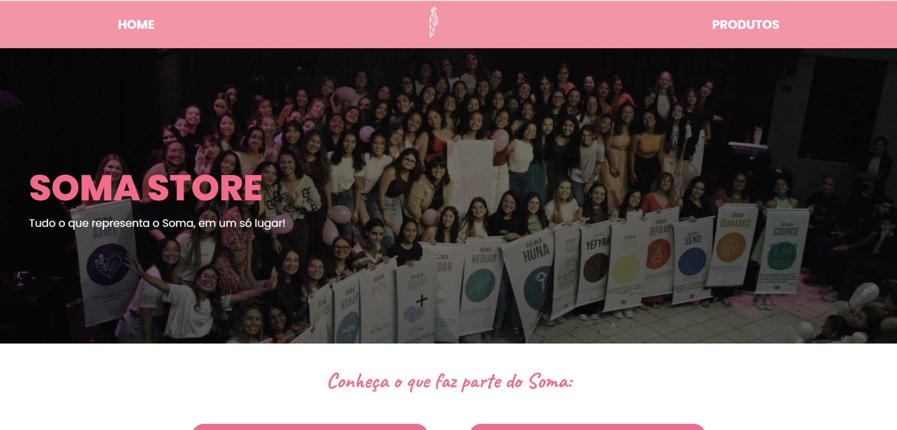

# 🛍️ Soma Store

  

Projeto desenvolvido com o objetivo de simular uma loja virtual para a divulgação e comercialização dos produtos oficiais do **Soma**. A aplicação foi criada como forma de praticar conceitos de desenvolvimento Front-end, aplicando técnicas de estruturação, estilização, responsividade e interatividade em uma interface moderna e intuitiva.

---

## 🌐 Tecnologias utilizadas

- HTML5
- CSS3
- JavaScript
- Google Fonts
- Font Awesome

---

## 💡 Sobre o projeto

O **Soma Store** apresenta um catálogo de produtos oficiais do Soma, permitindo que os usuários visualizem informações detalhadas de cada item e entrem em contato diretamente pelo WhatsApp para realizar pedidos ou esclarecer dúvidas.

Durante o desenvolvimento, foram aplicados conceitos como responsividade, animações, efeitos visuais, navegação por âncoras e boas práticas de organização de código, proporcionando uma experiência agradável em diferentes dispositivos.

O projeto também foi pensado para receber novas funcionalidades futuramente, acompanhando a evolução dos conhecimentos em desenvolvimento web.

---

## ✨ Funcionalidades

- Página inicial com banner em destaque;
- Catálogo de produtos;
- Página individual para cada produto;
- Integração com WhatsApp para solicitação de pedidos;
- Efeitos de interação (*hover*) em botões, imagens e cards;
- Navegação suave entre as seções da página;
- Layout responsivo para desktop, tablet e smartphone.
